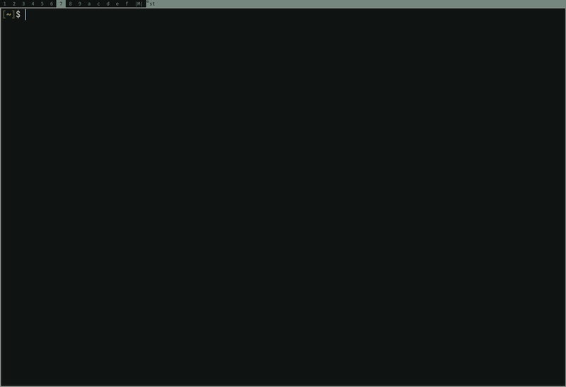

# snipmenu



A simple snippet manager using dmenu for quick access to text snippets.

## Features

- Do CRUD on file_name:file_content pairs stored as plaintext files in a directory. Reading copies to the clipboard.
- Stores snippets in `~/.config/snipmenu/snippets`

## Dependencies

- `dmenu` - Menu interface
- `xclip` - Clipboard management
- `$EDITOR` - Your preferred text editor

## Installation

```bash
git clone https://github.com/cinardoruk/snipmenu.git
cd snipmenu
chmod +x snipmenu
```

Optionally, add to your PATH:
```bash
sudo cp snipmenu.sh /usr/local/bin/snipmenu
```

And add to your dwm `config.h`:
```c
static Key keys[] = {
	...
	{ MODKEY|ShiftMask,		XK_v,		spawn,		SHCMD("snipmenu") },
	{ MODKEY|ShiftMask,		XK_c,		spawn,		SHCMD("snipmenu create") },
	{ MODKEY|ShiftMask,		XK_x,		spawn,		SHCMD("snipmenu delete") },
	...
	}
```

## Usage

```bash
./snipmenu.sh		    # Select and copy snippet to clipboard
./snipmenu.sh create    # Create new snippet
./snipmenu.sh update    # Edit existing snippet
./snipmenu.sh delete    # Delete snippet
```

## License

GPGv3
